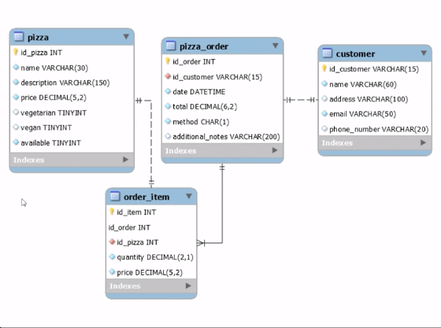

# API for resquest Pizzas


## Objetivo del proyecto

    Este proyecto busca modelar una api mediante la cual podremos consultar
    reglas de negocio relacionadas con una pizzeria, la idea es mejorar las 
    habilidades construyendo API's, patrones de diseño, patrones SOLID y 
    buenas practicas de programacion en general, se usara conexion con base 
    de datos MYSQL usando contenedores para la base de datos en local y probar
    conectar con un servicio de AWS como los es RDS para gestionar la base de datos
    desde la nube.

1. [Modelo de datos](#modelo-datos)
2. [API](#API)


I need to highlight these ==very important words==.

H<sub>2</sub>O

2<sup>2</sup>


---

<h2 id="API" style="text-align: center" > Tabla API </h2>

| Syntax | Description |
| ----------- | ----------- |
| Header | Title |
| Paragraph | Text |


<h2 id="modelo-datos" style="text-align: center">Modelo de datos</h2>



```
//block of clode
{
  "firstName": "John",
  "lastName": "Smith",
  "age": 25
}
```
```
//block of clode
{
  "firstName": "John",
  "lastName": "Smith",
  "age": 25
}
```
```
//block of clode
{
  "firstName": "John",
  "lastName": "Smith",
  "age": 25
}
```
```
//block of clode
{
  "firstName": "John",
  "lastName": "Smith",
  "age": 25
}
```
```
//block of clode
{
  "firstName": "John",
  "lastName": "Smith",
  "age": 25
}
```
<h3 id="custom-id">My Great Heading</h3>


    Indent paragraphs to include them in the footnote.

    `{ my code }`

    Add as many paragraphs as you like.